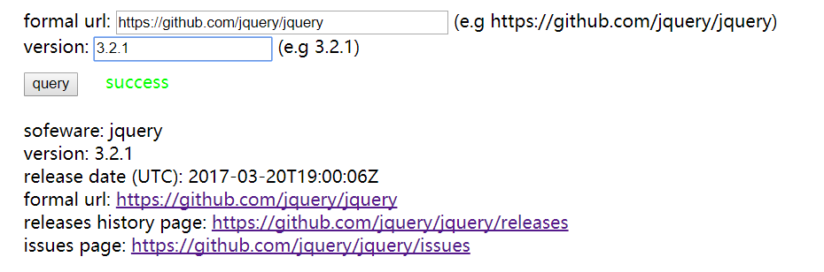

# Github-Api-Demo

## Introduction
A demo that show you how to use [github api](https://developer.github.com/v3/) to retrieve sofeware info.

## Run
Just pull index.html into one of your browsers.

## Screenshot
